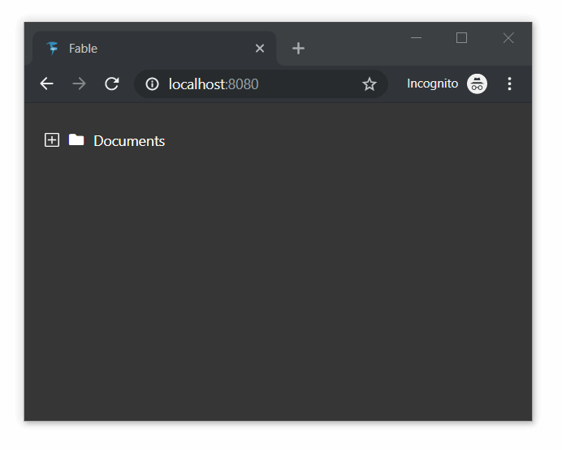

# Elmish.AnimatedTree [](https://ci.appveyor.com/project/Zaid-Ajaj/elmish-animatedtree) [](https://www.nuget.org/packages/Elmish.AnimatedTree)

A fork and binding of [react-animated-tree](https://github.com/drcmda/react-animated-tree), adapted to properly work within Elmish applications. It can be used to render recursive tree structure such as a file system tree:



### Install
Install the binding itself from Nuget:
```bash
dotnet add package Elmish.AnimatedTree
```
Install `react-spring` from npm:
```bash
npm install --save react-spring # version 8.0 or newer
```

### Example usage

Here is a function that recursively renders the nested structure:
```fs
let rec renderFile dispatch = function
  | File file ->
      AnimatedTree.animatedTree [
        AnimatedTree.Key file.Id
        AnimatedTree.Icon fileIcon
        AnimatedTree.Content (str file.Name)
      ]

  | Directory directory ->
      AnimatedTree.animatedTree [
        AnimatedTree.Key directory.Id
        AnimatedTree.Icon (if directory.IsOpen then openFolderIcon else closedFolderIcon)
        AnimatedTree.Content (str directory.Name)
        AnimatedTree.IsOpen directory.IsOpen
        AnimatedTree.OnToggled (fun _ -> dispatch (ToggleDirectory directory.Id))
        AnimatedTree.Children [ for file in directory.Children -> renderFile dispatch file  ]
      ]
```

### Full Example (see [Live](https://zaid-ajaj.github.io/Elmish.AnimatedTree/))

And here is the full Elmish program.
```fs
type FileItem =
  | Directory of {| Id: int; Name: string; IsOpen: bool; Children: FileItem list |}
  | File of {| Id: int; Name: string |}

type State = { Files : FileItem list }

type Msg =
  | ToggleDirectory of int

let init() = {
  Files = [
    Directory {|
      Id = 1;
      Name = "Documents";
      IsOpen = false ;
      Children = [
        File {| Id = 2; Name = "report.pdf" |};
        File {| Id = 3; Name = "image.png" |}
        Directory {|
          Id = 4;
          Name = "Programs";
          IsOpen = false;
          Children = [
            File {| Id = 5; Name = "word.exe" |}
          ]
        |}
      ]
    |}
  ]
}

let rec toggleDirectoryOpened id = function
  | File file -> File file
  | Directory directory when directory.Id = id ->
      Directory {| directory with IsOpen = not directory.IsOpen |}
  | Directory directory ->
      Directory {| directory with Children = List.map (toggleDirectoryOpened id) directory.Children |}

let update (msg: Msg) (state: State) =
  match msg with
  | ToggleDirectory id -> { state with Files = List.map (toggleDirectoryOpened id) state.Files }

let fileIcon = i [ Class "fa fa-file" ] [ ]
let openFolderIcon = i [ Class "fa fa-folder-open" ] [ ]
let closedFolderIcon = i [ Class "fa fa-folder" ] [ ]

let rec renderFile dispatch = function
  | File file ->
      AnimatedTree.animatedTree [
        AnimatedTree.Key file.Id
        AnimatedTree.Icon fileIcon
        AnimatedTree.Content (str file.Name)
      ]

  | Directory directory ->
      AnimatedTree.animatedTree [
        AnimatedTree.Key directory.Id
        AnimatedTree.Icon (if directory.IsOpen then openFolderIcon else closedFolderIcon)
        AnimatedTree.Content (str directory.Name)
        AnimatedTree.IsOpen directory.IsOpen
        AnimatedTree.OnToggled (fun _ -> dispatch (ToggleDirectory directory.Id))
        AnimatedTree.Children [ for file in directory.Children -> renderFile dispatch file  ]
      ]

let render (state: State) (dispatch: Msg -> unit) =
  div [ ] [
    for file in state.Files -> renderFile dispatch file
  ]
```